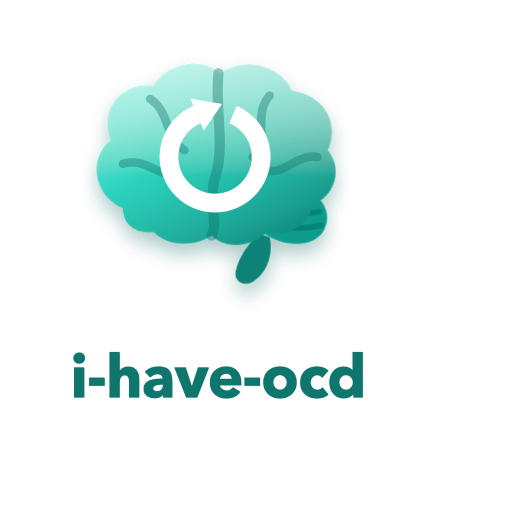

<p align="center">
  <picture>
    <source media="(prefers-color-scheme: dark)" srcset="../../logo-dark.png">
    
  </picture>
</p>
<p align="center">
  <strong align="center">Kindlusele vormitud väljund. OCD diagnoosi pole vaja!</strong>
</p>
<p align="center">
  <a href="../../LICENSE"></a>
  <a href="https://github.com/Hovo-Dev/i-have-ocd/stargazers"></a>
</p>

<p align="center">
  <a href="../../README.md" title="English" aria-label="English">🇬🇧</a> ·
  <a href="README.zh-CN.md" title="简体中文" aria-label="简体中文">🇨🇳</a> ·
  <a href="README.es.md" title="Español" aria-label="Español">🇪🇸</a> ·
  <a href="README.pt-BR.md" title="Português (Brasil)" aria-label="Português (Brasil)">🇧🇷</a> ·
  <a href="README.ja.md" title="日本語" aria-label="日本語">🇯🇵</a> ·
  <a href="README.ko.md" title="한국어" aria-label="한국어">🇰🇷</a> ·
  <a href="README.ru.md" title="Русский" aria-label="Русский">🇷🇺</a> ·
  <a href="README.fr.md" title="Français" aria-label="Français">🇫🇷</a> ·
  <a href="README.de.md" title="Deutsch" aria-label="Deutsch">🇩🇪</a> ·
  <a href="README.tr.md" title="Türkçe" aria-label="Türkçe">🇹🇷</a> ·
  <strong title="Eesti" aria-label="Eesti">🇪🇪</strong> ·
  <a href="README.sr.md" title="Српски" aria-label="Српски">🇷🇸</a> ·
  <a href="README.ka.md" title="ქართული" aria-label="ქართული">🇬🇪</a> ·
  <a href="README.hy.md" title="Հայերեն" aria-label="Հայերեն">🇦🇲</a> ·
  <a href="README.ar.md" title="العربية" aria-label="العربية">🇸🇦</a>
</p>

<div>

## Paigaldamine

Kopeeri ja kleebi oma CLI viipale:

```text
Install the i-have-ocd skill/plugin from https://github.com/Hovo-Dev/i-have-ocd, refer to the repo's AGENTS.md for instructions.
```

Või 🔗 [vaata paigaldusjuhiseid](../../INSTALL.md).

## Mida see teeb

Oskus sinu programmeerimisassistendile, mis takistab tal öelda „peaks töötama“. Täpsed muudatused. Kas kontrollitud või selgesõnaliselt märgitud, et kontrollimata. Kõik lahtised otsad ühes nimekirjas — ja nimekiri ütleb `none`, kui see on tühi.

## Mis muutub

<table>
<tr>
<td width="50%">

## Enne

> Uuendasin autentimisloogikat ja koristasin teel paar asja ära. See peaks lahendama need 401-d, mida nägid. Tokeni värskendamise juures võib olla mõni äärejuhtum, aga tõenäoliselt on kõik korras — põhitee näeb nüüd hea välja. Anna teada, kui midagi kahtlast tundub!

</td>

<td width="50%">

## Pärast

> **Changed:** `src/auth.ts:42-58` — `verifyToken` kutsub nüüd `jwt.verify` RS256 võtmega muutujast `AUTH_PUBLIC_KEY`.
>
> **Verified:** `npm test -- auth.spec.ts` → 14 läbis, 0 ebaõnnestus.
>
> **Not touched:** sessiooni vahevara, küpsiste seadistus, sisselogimisliides.
>
> **Open:** tokeni värskendamine üle 24 h on kontrollimata — ükski test ei kata seda teed.

</td>
</tr>
</table>

## Reeglid

Neid on kümme. Täisversioon on failis [SKILL.md](../../skills/i-have-ocd/SKILL.md).

1. Ütle täpselt, mis muutus — fail, read, sümbol.
2. Mitte kunagi „peaks töötama“. Kas kontrollitud või selgesõnaliselt kontrollimata.
3. Tehtud või tegemata. Kolmandat olekut ei ole.
4. Nimeta see, mida sa ei puutunud.
5. Üks vastus, mitte menüü.
6. Teadmata asjad lähevad ühte `Open:` nimekirja — mis ütleb `none`, kui on tühi.
7. Ei mingit rahustamist. Näita selle asemel väljundit.
8. Vigadel on täpne põhjus, mitte ümbersõnastatud sümptom.
9. Ei mingeid täitesõnu kiituseks.
10. Piiritle iga vastus: mida see katab ja mida mitte.

Ja üks reegel, mis kaalub üles kõik kümme: **täpsus ei ole väljamõtlemine.** Ära kunagi leiuta reanumbrit, mida sa ei lugenud.

## Nime kohta

Nali on nimes. Oskus ise ei ole nali ja see ei rahusta meelega — rahustuse otsimine ongi sundus, mitte ravi. Selle asemel keeldub ta jätmast ühtki väidet kontrollimata. Sellest võidab iga lugeja ja seda ei tee ükski assistent vaikimisi.

## Kohanda

Tee fork, muuda faili `skills/i-have-ocd/SKILL.md` ja pane siis oma koopia asemele:

```bash
claude plugin uninstall i-have-ocd            # eemalda esmalt algne koopia:
claude plugin marketplace remove i-have-ocd   # fork ja algne jagavad mõlemat nime
claude plugin marketplace add <your-username>/i-have-ocd
claude plugin install i-have-ocd@i-have-ocd
```

Taaskäivita oma programmeerimisassistent ja kutsu `/i-have-ocd` uuesti.

## Panustamine

Eriti teretulnud on tõlked — vaata [CONTRIBUTING.md](../../CONTRIBUTING.md).

## Tänud

Selle repo kuju — üks `SKILL.md`, enne/pärast tabel, paigaldusteed agendi kaupa — järgib projekti [i-have-adhd](https://github.com/ayghri/i-have-adhd), mille autor on [Ayoub Ghriss](https://github.com/ayghri); see jõudis kohale esimesena ja on MIT-litsentsiga. Siinsed reeglid on kirjutatud nullist ja tõmbavad vastupidises suunas: too oskus optimeerib *alustamist* (tegevus ette, ülejäänu maha), see siin *lõpetamist* (mitte midagi kontrollimata, mitte midagi piiritlemata). Nad sobivad hästi kokku. Paigalda mõlemad.

## Litsents

[MIT](../../LICENSE).

Pane ⭐, kui see säästis sind ühest ringist „oota, kas ta tõesti jooksutas testid?“

</div>
